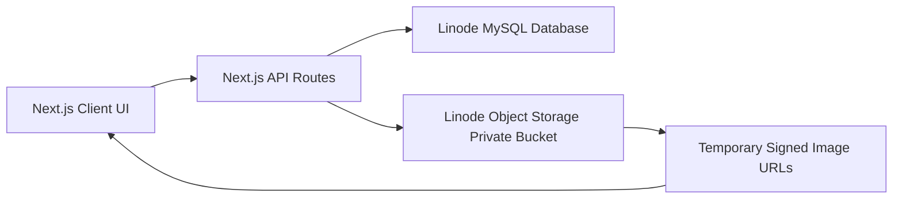

# Stockpile — Inventory Management Dashboard

A modern inventory management dashboard built with **Next.js 15**, **Tailwind CSS v4**, persistent **MySQL** storage, and private **Linode Object Storage** image uploads.

## Features

- **Dashboard** — consolidated or manufacturer-specific KPI stat cards, inventory value, low/out-of-stock counts, stock-by-category bars, and a "needs attention" list.
- **Products** — compact product card grid with search, category/status filters, manufacturer filter, persistent delete, and 5-image gallery preview.
- **Manufacturers** — add new manufacturers, rename existing manufacturers, and filter products by manufacturer.
- **Add Product** — validated form with manufacturer selection, INR pricing, live margin calculation, status selector, and **multi-image upload (up to 5 images)**.
- **Bulk Upload** — import products from `.csv`, `.xls`, or `.xlsx` for a selected manufacturer, with downloadable CSV/Excel templates.
- **Inventory** — consolidated or manufacturer-specific table view with INR selling price, unit cost, stock value, status tabs, inline stock adjustment, and per-product editing.
- **Persistent backend** — products are stored in MySQL, image files are stored privately in Linode Object Storage, and the UI displays temporary signed image URLs.

## Architecture



## Step 1: Create the MySQL Database and Tables

Run the SQL script in `database/schema.sql` against your Linode MySQL instance:

```bash
mysql -h YOUR_MYSQL_HOST -P 3306 -u YOUR_MYSQL_USER -p < database/schema.sql
```

The script creates:

- Database: `inventory_portal`
- Table: `manufacturers`
- Table: `products`
- Table: `product_images`
- Indexes for SKU, manufacturer, category, status, stock checks, and image ordering
- Optional sample product rows using `ON DUPLICATE KEY UPDATE`

Core schema:

```sql
CREATE DATABASE IF NOT EXISTS inventory_portal
  CHARACTER SET utf8mb4
  COLLATE utf8mb4_unicode_ci;

CREATE TABLE IF NOT EXISTS manufacturers (
  id BIGINT UNSIGNED NOT NULL AUTO_INCREMENT,
  name VARCHAR(255) NOT NULL,
  created_at TIMESTAMP NOT NULL DEFAULT CURRENT_TIMESTAMP,
  updated_at TIMESTAMP NOT NULL DEFAULT CURRENT_TIMESTAMP ON UPDATE CURRENT_TIMESTAMP,
  PRIMARY KEY (id),
  UNIQUE KEY uq_manufacturers_name (name)
) ENGINE=InnoDB;

CREATE TABLE IF NOT EXISTS products (
  id BIGINT UNSIGNED NOT NULL AUTO_INCREMENT,
  manufacturer_id BIGINT UNSIGNED NULL,
  name VARCHAR(255) NOT NULL,
  sku VARCHAR(100) NOT NULL,
  category VARCHAR(100) NOT NULL,
  description TEXT NULL,
  selling_price DECIMAL(12, 2) NOT NULL DEFAULT 0.00,
  discount_percent DECIMAL(5, 2) NOT NULL DEFAULT 0.00,
  unit_cost DECIMAL(12, 2) NOT NULL DEFAULT 0.00,
  quantity INT UNSIGNED NOT NULL DEFAULT 0,
  reorder_level INT UNSIGNED NOT NULL DEFAULT 0,
  status ENUM('active', 'draft', 'archived') NOT NULL DEFAULT 'active',
  created_at TIMESTAMP NOT NULL DEFAULT CURRENT_TIMESTAMP,
  updated_at TIMESTAMP NOT NULL DEFAULT CURRENT_TIMESTAMP ON UPDATE CURRENT_TIMESTAMP,
  PRIMARY KEY (id),
  UNIQUE KEY uq_products_sku (sku),
  CONSTRAINT fk_products_manufacturer
    FOREIGN KEY (manufacturer_id) REFERENCES manufacturers(id)
    ON DELETE SET NULL
) ENGINE=InnoDB;

CREATE TABLE IF NOT EXISTS product_images (
  id BIGINT UNSIGNED NOT NULL AUTO_INCREMENT,
  product_id BIGINT UNSIGNED NOT NULL,
  object_key VARCHAR(500) NOT NULL,
  original_filename VARCHAR(255) NULL,
  content_type VARCHAR(100) NOT NULL,
  size_bytes INT UNSIGNED NULL,
  sort_order TINYINT UNSIGNED NOT NULL DEFAULT 0,
  created_at TIMESTAMP NOT NULL DEFAULT CURRENT_TIMESTAMP,
  PRIMARY KEY (id),
  UNIQUE KEY uq_product_images_object_key (object_key),
  CONSTRAINT fk_product_images_product
    FOREIGN KEY (product_id) REFERENCES products(id)
    ON DELETE CASCADE
) ENGINE=InnoDB;
```

Use `database/schema.sql` as the source of truth because it also includes secondary indexes, default manufacturers (`ABC`, `BCD`, `CDE`, `DEF`, `EFI`), and seed data.

If you already created the earlier schema before manufacturers existed, run this one-time migration instead of recreating the whole database:

```bash
mysql -h YOUR_MYSQL_HOST -P 3306 -u YOUR_MYSQL_USER -p inventory_portal < database/migrations/001_add_manufacturers.sql
```

If you already have the manufacturers migration applied, run the discount migration once:

```bash
mysql -h YOUR_MYSQL_HOST -P 3306 -u YOUR_MYSQL_USER -p inventory_portal < database/migrations/002_add_discount_percent.sql
```

## Step 2: Configure Linode Object Storage

1. Create a Linode Object Storage bucket in your desired region.
2. Keep the bucket private.
3. Create an access key with read/write access to that bucket.
4. Note the S3-compatible endpoint from Linode Cloud Manager. Examples:
   - `https://ap-south-1.linodeobjects.com`
   - `https://in-maa-1.linodeobjects.com`
   - `https://eu-central-1.linodeobjects.com`

The app stores only object keys in MySQL. It generates short-lived signed URLs from the Next.js API whenever products are loaded.

## Step 3: Configure Environment Variables

Create `.env.local` using `.env.example` as the template:

```bash
MYSQL_HOST=YOUR_MYSQL_HOST
MYSQL_PORT=3306
MYSQL_DATABASE=inventory_portal
MYSQL_USER=YOUR_MYSQL_USER
MYSQL_PASSWORD=YOUR_MYSQL_PASSWORD
MYSQL_SSL=false

LINODE_OBJECT_STORAGE_ENDPOINT=https://YOUR-ENDPOINT.linodeobjects.com
LINODE_OBJECT_STORAGE_REGION=YOUR_REGION
LINODE_OBJECT_STORAGE_BUCKET=YOUR_BUCKET
LINODE_OBJECT_STORAGE_ACCESS_KEY_ID=YOUR_ACCESS_KEY
LINODE_OBJECT_STORAGE_SECRET_ACCESS_KEY=YOUR_SECRET_KEY
LINODE_SIGNED_URL_EXPIRES_SECONDS=3600
```

Set `MYSQL_SSL=true` only if your Linode MySQL configuration requires SSL with trusted certificates.

## Step 4: Install and Run

```bash
npm install
npm run dev
```

Open [http://localhost:3000](http://localhost:3000).

Check backend connectivity after `.env.local` is configured:

```bash
curl http://localhost:3000/api/health
```

Expected response:

```json
{ "ok": true }
```

## Step 5: Verify the App Flow

1. Open the Dashboard and confirm products load from MySQL.
2. Open Products and verify the product list appears.
3. Add a product with up to 5 images.
4. Add or rename a manufacturer from the Products page.
5. Select a manufacturer and bulk upload a `.csv`, `.xls`, or `.xlsx` file.
6. Confirm rows are created in `manufacturers`, `products`, and `product_images`.
7. Confirm image objects are created under `product-images/{productId}/...` in Linode Object Storage.
8. Open Dashboard or Inventory and switch between all manufacturers and a single manufacturer.
9. Open Inventory and update product name, SKU, description, manufacturer, selling price, discount, quantity, unit cost, reorder level, status, or replacement pictures.
10. Delete a product and confirm the database row is removed. The API also attempts to remove matching object storage files.

Bulk upload columns:

```text
name, sku, category, description, price, discountPercent, cost, quantity, reorderLevel, status, imageFolderPath, image1, image2, image3, image4, image5
```

Supported status values are `active`, `draft`, and `archived`. Uploaded rows are assigned to the selected manufacturer.

Template downloads are available from the Products page:

- CSV template: `/api/products/template`
- Excel template: `/api/products/template?format=xlsx`

The image path columns are optional references for organizing product pictures by SKU or folder. Browser uploads cannot import local image files only from a text path; upload actual images through Add Product or the Inventory edit picture replacement option.

## API Routes

- `GET /api/products` — fetch products from MySQL with signed image URLs.
- `POST /api/products` — create a product and upload images to Linode Object Storage.
- `PATCH /api/products/:id` — update product or inventory fields.
- `DELETE /api/products/:id` — delete a product and its image metadata/files.
- `POST /api/products/bulk` — bulk import `.csv`, `.xls`, or `.xlsx` products for a manufacturer.
- `GET /api/products/template` — download the CSV/Excel bulk upload template.
- `GET /api/manufacturers` — fetch manufacturers.
- `POST /api/manufacturers` — create a manufacturer.
- `PATCH /api/manufacturers/:id` — rename a manufacturer.
- `GET /api/health` — verify MySQL connectivity.

## Project Structure

```text
database/
├── schema.sql
└── migrations/
    ├── 001_add_manufacturers.sql
    └── 002_add_discount_percent.sql
src/
├── app/
│   ├── api/
│   │   ├── health/route.ts
│   │   ├── manufacturers/
│   │   └── products/
│   │       ├── route.ts
│   │       ├── [id]/route.ts
│   │       └── bulk/route.ts
│   ├── page.tsx
│   ├── products/
│   └── inventory/
├── components/
│   ├── ImageUploader.tsx
│   └── ...
├── context/
│   └── InventoryContext.tsx
└── lib/
    ├── db.ts
    ├── env.ts
    ├── productRepository.ts
    ├── storage.ts
    ├── types.ts
    └── utils.ts
```

## Operational Notes

- Real credentials belong in `.env.local`; `.env.example` is safe to commit.
- Product images are private in Object Storage. Browser-visible image links are signed and expire after `LINODE_SIGNED_URL_EXPIRES_SECONDS`.
- If a signed URL expires while a page is open, refresh the products list to get fresh URLs.
- MySQL stores prices in INR-compatible decimal columns; the UI formats values with the rupee symbol.
- The app requires the database schema before product CRUD will work.
